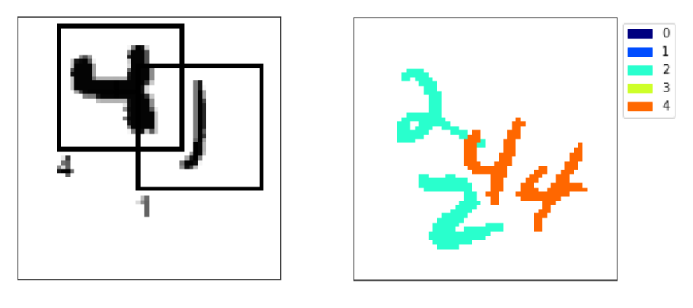

# Simple deep learning



The field of deep learning is vast. The sheer number of publications on the subject is enough to overwhelm anyone. In the series "Simple deep learning" we'll be taking a step back. We'll forget about the latest tips and tricks that are pushing the state of the art. Instead, through the use of simple datasets and toy problems, we'll explore the basis of deep learning to give you a better understanding of the big picture.

This series currently contains the following posts:
- [MNIST extended: a simple dataset for semantic segmentation and object detection](./mnist_extended.ipynb)
- [A simple example of semantic segmentation with tensorflow keras](./semantic_segmentation.ipynb)

## Installation
These posts use the simple_deep_learning package which contains helper functions. If you'rerunning the notebooks from within this repository, there's no need to install the package. In case you want to have access to the helper functions from another directory, you can install the package by cloning the repository and running:

```
pip install -e /path/to/simple-deep-learning
```
This will give you access to all the helper functions from anywhere on your computer.

If you only need the dependencies, from within the repository run:
```
pip install -r requirements.txt
```


